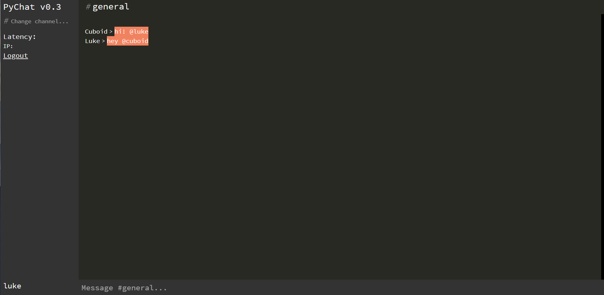

# pychat-themes
This repo is dedicated to themes for [PyChat](https://chat.dj-electro.me) by DJ Electro.
This project is lead by **luke#1000** and **Cuboid#3163** on Discord

# Using The Themes
## These are instructions for setting up any themes until the built-in Theme Switcher is setup

Install the Stylus browser extension

Firefox: https://addons.mozilla.org/en-US/firefox/addon/styl-us/
Chrome: https://chrome.google.com/webstore/detail/stylus/clngdbkpkpeebahjckkjfobafhncgmne
Opera: https://addons.opera.com/en/extensions/details/stylus/

After you've installed Stylus,
find it in the extensions tool bar, and click Write "Style for: chat.dj-electro.me/this URL" Make sure that the this URL part is highlighted otherwise it won't work, Find the CSS stylesheet for the theme you'd like usually called "theme.css" Copy all the code with Ctrl+A, and paste it in to Stylus with Ctrl+V, after that find the part where it says "Applies to URLS STARTING WITH https://chat.dj-electro.me/chat/blahblahblah" remove everything after chat if you want the theme to be global. Now press Ctrl+S to save the css and refresh pychat. Now you should have succesfully installed a pychat-themes theme for your PyChat! If you need any help contact Luke#1000, or Cuboid#3163 on the Endless Hosting discord server.

#1: **PyIDE** by *luke*

